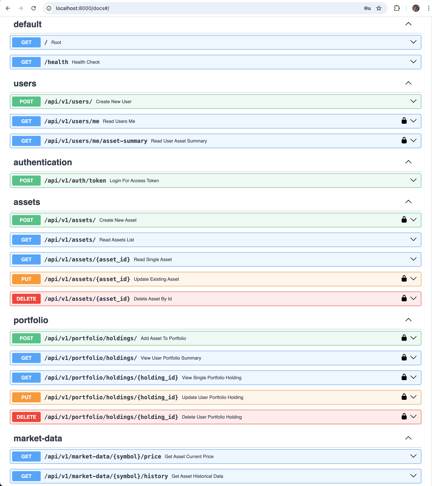
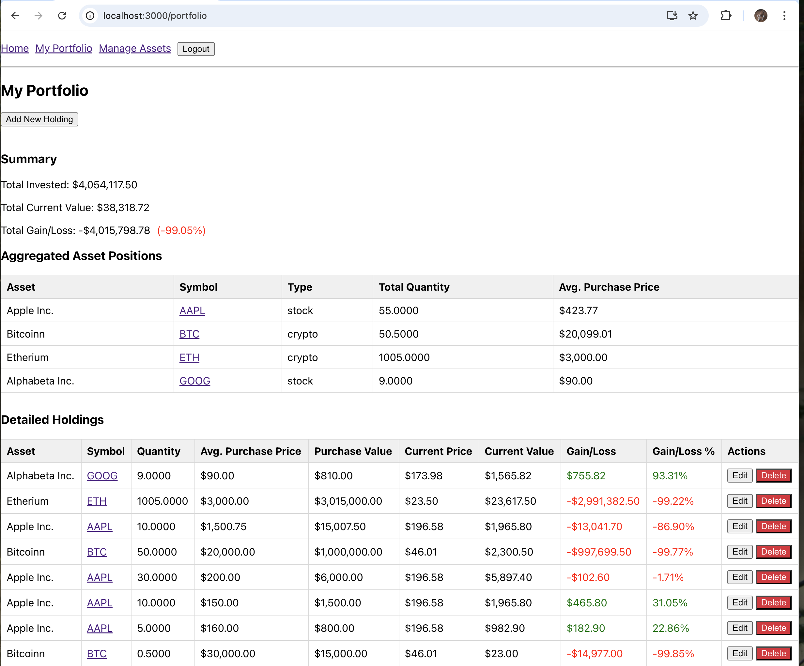

# AlphaDash - Financial Portfolio & Signal Analyzer

## Overview

AlphaDash is a full-stack web application designed to help users track their financial asset portfolios, visualize historical performance, and explore basic trading signals. It demonstrates a range of modern software engineering practices and technologies.

## Key Features

*   User Authentication (Registration, Login with JWT)
*   Portfolio Management:
    *   Add/Edit/Delete asset holdings (quantity, purchase price, date)
    *   View portfolio summary with real-time(ish) valuation
    *   Calculated current values, gains/losses per holding and total
*   Asset Management:
    *   System for defining global assets (stocks, cryptocurrencies)
    *   Users can create new assets if not already in the system
*   Financial Data Integration:
    *   Fetches current prices and historical data from external financial APIs (primarily Yahoo Finance, with Alpha Vantage as an optional fallback)
    *   Caching mechanism for external API responses (Redis)
*   Data Visualization:
    *   Historical price charts for individual assets
    *   Display of Simple Moving Averages (SMA 20, SMA 50) on charts
*   Asynchronous Task Processing:
    *   Background tasks (Celery with Redis broker) for periodic data refresh (all asset prices)
*   Containerized Deployment:
    *   Fully containerized using Docker and Docker Compose for easy setup and consistent environments.
*   Automated Testing & CI:
    *   Comprehensive unit tests for backend (Pytest)
    *   Basic CI pipeline using GitHub Actions (linting, formatting, testing, build checks)

## Tech Stack

### Backend
*   **Language:** Python 3.13
*   **Framework:** FastAPI
*   **Authentication:** JWT (python-jose), Passlib (for password hashing)
*   **Database:** PostgreSQL
*   **ORM:** SQLAlchemy with Alembic for migrations
*   **Data Validation:** Pydantic
*   **Asynchronous Tasks:** Celery, Redis (as broker and result backend)
*   **Caching:** Redis (for application-level shared cache)
*   **External APIs:** Yahoo Finance (via `yfinance`), Alpha Vantage (as fallback)
*   **Linters/Formatters:** Ruff, Black

### Frontend
*   **Language:** TypeScript
*   **Framework/Library:** React
*   **State Management:** React Hooks like `useState`, `useEffect`
*   **Routing:** React Router DOM
*   **API Client:** Axios
*   **Charting:** Chart.js with react-chartjs-2, date-fns adapter
*   **Styling:** Basic CSS/Inline Styles

### DevOps & Infrastructure
*   **Containerization:** Docker, Docker Compose
*   **CI/CD:** GitHub Actions (Linting, Formatting, Testing, Docker Build)
*   **Version Control:** Git, GitHub

## Architecture Overview

The application follows a modern full-stack architecture:
*   **Frontend:** A React application responsible for user interaction and presentation.
*   **Backend:** A Python FastAPI application serving a RESTful API for all business logic, data processing, and external API interactions.
*   **Database:** PostgreSQL stores persistent data like user information, asset definitions, and portfolio holdings.
*   **Caching Layer:** Redis is used for caching frequently accessed data (e.g., asset prices from external APIs) to improve performance and reduce external API load.
*   **Task Queue:** Celery with Redis as a broker handles asynchronous background tasks, such as periodic refreshment of asset prices.
*   **Containerization:** All services (frontend, backend, database, Redis, Celery workers/beat) are containerized with Docker and orchestrated using Docker Compose for local development and ensuring a consistent environment.

Simple text diagram:

```
[ User (Browser) ] <--> [ React Frontend (localhost:3000) ]
^
| (HTTP API Calls)
v
[ FastAPI Backend (localhost:8000) ] <--> [ PostgreSQL DB ]
^ ^ |
| | +--> [ Redis (Cache & Celery Broker) ]
| |
+---------+------> [ Celery Workers & Beat (Background Tasks) ]
|
+------> [ External Financial APIs (Yahoo Finance, Alpha Vantage) ]
```

## Getting Started / Local Setup

### Prerequisites

*   Docker Desktop (or Docker Engine + Docker Compose) installed and running.
*   Git installed.
*   (Optional, for direct backend/frontend dev without full Docker Compose build initially) Python 3.13 and Node.js v24 installed.

### Installation & Running

1.  **Clone the repository:**
    ```bash
    git clone https://github.com/zhu-weijie/alpha-dash.git
    cd alpha-dash
    ```

2.  **Environment Configuration:**
    *   **Root `.env` for Docker Compose:**
        Create a `.env` file in the project root (same directory as `docker-compose.yml`). This file is used by Docker Compose to inject environment variables into services. Refer to `.env.example` for required variables.
        Example content for `alpha-dash/.env`:
        ```env
        SECRET_KEY="a_very_strong_random_secret_key_for_jwt_at_least_32_chars"
        ALGORITHM="HS256"
        ALPHA_VANTAGE_API_KEY="YOUR_OPTIONAL_AV_KEY"
        # Other variables like PROJECT_NAME, ACCESS_TOKEN_EXPIRE_MINUTES if you want to override defaults
        ```
    *   **Backend `.env` for direct Python execution (and source for Pydantic settings if CI env vars not set):**
        Navigate to the `backend/` directory. Copy `backend/.env.example` to `backend/.env` and fill in the required values (especially if you plan to run the backend outside Docker for some tests, or if your Celery tasks/Alembic need it when run locally).
        ```bash
        cd backend
        cp .env.example .env
        # Edit backend/.env with your local settings (e.g., DATABASE_URL if running DB outside Docker)
        # However, for Docker Compose, the DATABASE_URL inside the container is set by docker-compose.yml
        cd .. 
        ```

3.  **Build and Run with Docker Compose:**
    From the project root directory (where `docker-compose.yml` is located):
    ```bash
    docker compose up --build -d
    ```
    *   `--build`: Builds the Docker images for the backend and frontend if they don't exist or if Dockerfiles have changed.
    *   `-d`: Runs the containers in detached mode (in the background).

4.  **Apply Database Migrations (if first time or after DB reset):**
    The backend service itself does not automatically run migrations on startup. You need to run them manually against the running database container.
    Open a new terminal:
    ```bash
    # Navigate to project root
    cd alpha-dash
    # Execute alembic upgrade command inside the backend container (or locally if DB exposed and configured)
    docker compose exec backend alembic upgrade head
    # OR, if running locally from backend directory (ensure venv active):
    # cd backend
    # python3.13 -m venv .venv
    # source .venv/bin/activate
    # pip install -r requirements.txt
    # alembic upgrade head 
    ```

5.  **Accessing the Application:**
    *   **Frontend:** Open your browser and navigate to `http://localhost:3000`
    *   **Backend API Docs (Swagger UI):** `http://localhost:8000/docs`
    *   **Backend API Docs (ReDoc):** `http://localhost:8000/redoc`

6.  **Stopping the Application:**
    From the project root directory:
    ```bash
    docker compose down
    ```
    To also remove volumes (database data, Redis data, Celery beat schedule):
    ```bash
    docker compose down --volumes
    ```

## API Endpoints Overview

The backend provides a RESTful API. Key endpoint groups include:
*   `/api/v1/auth/token`: User login and JWT generation.
*   `/api/v1/users/`: User registration, fetching current user (`/me`).
*   `/api/v1/assets/`: CRUD operations for global asset definitions.
*   `/api/v1/portfolio/holdings/`: CRUD operations for user-specific portfolio holdings.
*   `/api/v1/market-data/{symbol}/`: Fetching current price and historical data for assets.

For detailed API documentation, please run the application and visit `http://localhost:8000/docs`.

Here is a screenshot of the API docs:


## Key Technical Review Points

*   **Full-Stack Development:** Building both backend (Python/FastAPI) and frontend (React/TypeScript) components.
*   **API Design & Development:** Creating RESTful APIs with FastAPI, including request/response validation (Pydantic), authentication (JWT), and clear endpoint structuring.
*   **Database Management:**
    *   Working with PostgreSQL.
    *   Using SQLAlchemy for ORM and database interaction.
    *   Managing database schema migrations with Alembic.
*   **Authentication & Authorization:** Implementing secure user registration, password hashing (Passlib/bcrypt), and token-based authentication (JWT). Protecting API endpoints.
*   **Asynchronous Task Processing:** Utilizing Celery and Redis for background tasks (periodic data refresh), demonstrating understanding of distributed systems concepts.
*   **Caching Strategies:** Implementing caching (Redis) for external API responses to improve performance and manage rate limits.
*   **External API Integration:** Fetching and processing data from third-party financial APIs (Yahoo Finance, Alpha Vantage).
*   **Containerization:** Dockerizing all application services (backend, frontend, database, Redis, Celery) and orchestrating them with Docker Compose for development and consistent environments.
*   **Testing:**
    *   Writing unit tests for backend logic (CRUD, services, utilities) using Pytest and `unittest.mock`.
    *   Implementing basic API endpoint tests using FastAPI's `TestClient`.
*   **DevOps & CI/CD:** Setting up a basic Continuous Integration pipeline with GitHub Actions for automated linting, formatting, testing, and build checks.
*   **Modern Python & TypeScript:** Utilizing modern language features, type hinting, and asynchronous programming (FastAPI).
*   **Software Design Patterns:** (Implicitly) Service layer, data provider pattern, dependency injection (FastAPI).
*   **Problem Solving:** Addressing challenges like API rate limits, data serialization, and inter-service communication within a Dockerized environment.
*   **Project Structure & Maintainability:** Organizing code into logical modules and packages for better maintainability and scalability.

## Potential Future Enhancements

*   **Advanced "Alpha" Signals:** Implement more complex technical indicators or allow users to define simple signal conditions.
*   **Real-time Price Updates:** Integrate WebSockets for real-time price updates on the portfolio page.
*   **User Roles & Permissions:** Differentiate between regular users and admin users (e.g., for managing global assets).
*   **More Comprehensive Testing:** Add frontend unit/integration tests, expand backend integration test coverage.
*   **Deployment:** Script deployment to a cloud platform (e.g., GCP Cloud Run, AWS ECS/EKS).
*   **Enhanced UI/UX:** Utilize a component library for a more polished UI, improve form validations, and user feedback.
*   **Scalability Improvements for Data Fetching:** Implement more advanced batching or a dedicated data ingestion pipeline for financial data if scaling to many users/assets.
*   **OAuth2 Scopes:** Implement more granular permissions using OAuth2 scopes.

## Screenshots for the key pages

*   Portfolio Overview Page



*   Asset Chart Page


*   Add New Holding Page


*   Edit Holding Page


*   Add new asset page


*   Redis Cache Logs


*   Celery Worker Logs


*   Celery Beat Logs


