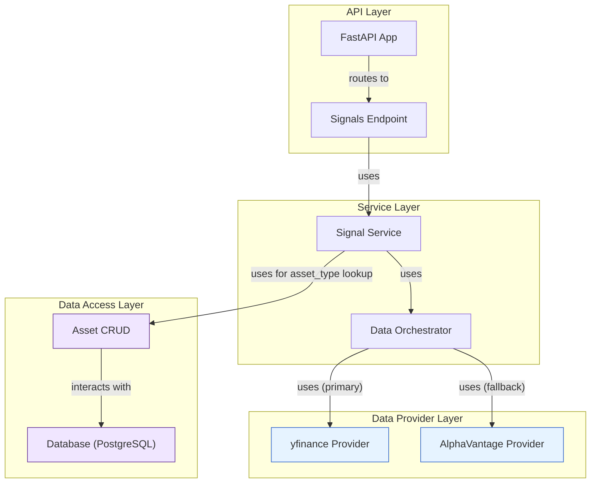

```mermaid
graph TD
    subgraph "API Layer"
        FastAPI_App["FastAPI App"]
        Signals_Endpoint["Signals Endpoint"]
    end

    subgraph "Service Layer"
        Signal_Service["Signal Service"]
        Data_Orchestrator["Data Orchestrator"]
    end
    
    subgraph "Data Provider Layer"
        yfinance_Provider["yfinance Provider"]
        AlphaVantage_Provider["AlphaVantage Provider"]
    end
    
    subgraph "Data Access Layer"
        Asset_CRUD["Asset CRUD"]
        Database["Database (PostgreSQL)"]
    end

    FastAPI_App -- "routes to" --> Signals_Endpoint
    Signals_Endpoint -- "uses" --> Signal_Service
    Signal_Service -- "uses" --> Data_Orchestrator
    Signal_Service -- "uses for asset_type lookup" --> Asset_CRUD
    
    Data_Orchestrator -- "uses (primary)" --> yfinance_Provider
    Data_Orchestrator -- "uses (fallback)" --> AlphaVantage_Provider

    Asset_CRUD -- "interacts with" --> Database
    
    style yfinance_Provider fill:#e6f3ff,stroke:#36c
    style AlphaVantage_Provider fill:#e6f3ff,stroke:#36c
    style Asset_CRUD fill:#f0e6ff,stroke:#639
    style Database fill:#f0e6ff,stroke:#639
```
