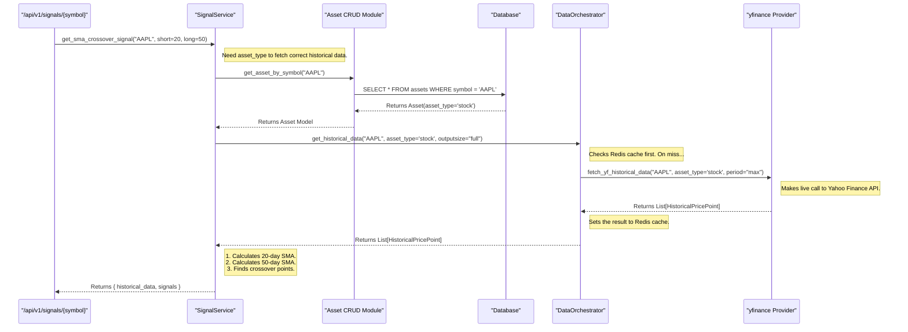

```mermaid
sequenceDiagram
    participant API as "/api/v1/signals/{symbol}"
    participant SigSvc as "SignalService"
    participant AssetCRUD as "Asset CRUD Module"
    participant DB as "Database"
    participant DataOrc as "DataOrchestrator"
    participant YFProv as "yfinance Provider"

    API->>SigSvc: get_sma_crossover_signal("AAPL", short=20, long=50)
    
    Note right of SigSvc: Need asset_type to fetch correct historical data.
    SigSvc->>AssetCRUD: get_asset_by_symbol("AAPL")
    
    AssetCRUD->>DB: SELECT * FROM assets WHERE symbol = 'AAPL'
    DB-->>AssetCRUD: Returns Asset(asset_type='stock')
    AssetCRUD-->>SigSvc: Returns Asset Model

    SigSvc->>DataOrc: get_historical_data("AAPL", asset_type='stock', outputsize="full")
    
    Note right of DataOrc: Checks Redis cache first. On miss...
    DataOrc->>YFProv: fetch_yf_historical_data("AAPL", asset_type='stock', period="max")
    
    Note right of YFProv: Makes live call to Yahoo Finance API.
    YFProv-->>DataOrc: Returns List[HistoricalPricePoint]
    
    Note right of DataOrc: Sets the result to Redis cache.
    DataOrc-->>SigSvc: Returns List[HistoricalPricePoint]
    
    Note right of SigSvc: 1. Calculates 20-day SMA.<br/>2. Calculates 50-day SMA.<br/>3. Finds crossover points.
    SigSvc-->>API: Returns { historical_data, signals }
```
