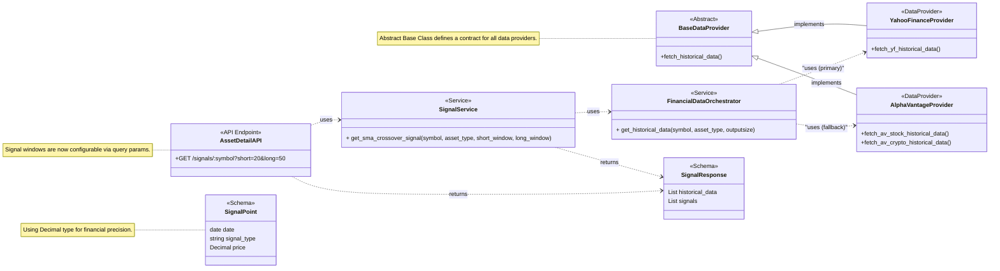

```mermaid
classDiagram
    direction LR

    class AssetDetailAPI {
        <<API Endpoint>>
        +GET /signals/:symbol?short=20&long=50
    }

    class SignalService {
        <<Service>>
        + get_sma_crossover_signal(symbol, asset_type, short_window, long_window)
    }
    
    class FinancialDataOrchestrator {
        <<Service>>
        + get_historical_data(symbol, asset_type, outputsize)
    }

    class BaseDataProvider {
        <<Abstract>>
        +fetch_historical_data()
    }

    class YahooFinanceProvider {
        <<DataProvider>>
        +fetch_yf_historical_data()
    }

    class AlphaVantageProvider {
        <<DataProvider>>
        +fetch_av_stock_historical_data()
        +fetch_av_crypto_historical_data()
    }

    class SignalResponse {
        <<Schema>>
        List historical_data
        List signals
    }

    class SignalPoint {
        <<Schema>>
        date date
        string signal_type
        Decimal price
    }
    
    AssetDetailAPI ..> SignalService : uses
    SignalService ..> FinancialDataOrchestrator : uses
    FinancialDataOrchestrator ..> YahooFinanceProvider : "uses (primary)"
    FinancialDataOrchestrator ..> AlphaVantageProvider : "uses (fallback)"
    
    BaseDataProvider <|-- YahooFinanceProvider : implements
    BaseDataProvider <|-- AlphaVantageProvider : implements
    
    AssetDetailAPI ..> SignalResponse : returns
    SignalService ..> SignalResponse : returns

    note for BaseDataProvider "Abstract Base Class defines a contract for all data providers."
    note for SignalPoint "Using Decimal type for financial precision."
    note for AssetDetailAPI "Signal windows are now configurable via query params."
```
