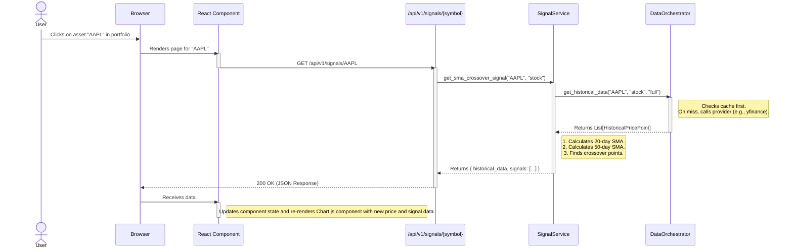

```mermaid
sequenceDiagram
    actor User
    participant Browser
    participant AssetDetailPage as React Component
    participant BackendAPI as /api/v1/signals/{symbol}
    participant SignalService
    participant DataOrchestrator
    
    User->>Browser: Clicks on asset "AAPL" in portfolio
    Browser->>AssetDetailPage: Renders page for "AAPL"
    
    activate AssetDetailPage
    AssetDetailPage->>BackendAPI: GET /api/v1/signals/AAPL
    deactivate AssetDetailPage
    
    activate BackendAPI
    BackendAPI->>SignalService: get_sma_crossover_signal("AAPL", "stock")
    
    activate SignalService
    SignalService->>DataOrchestrator: get_historical_data("AAPL", "stock", "full")
    
    activate DataOrchestrator
    Note right of DataOrchestrator: Checks cache first.<br/>On miss, calls provider (e.g., yfinance).
    DataOrchestrator-->>SignalService: Returns List[HistoricalPricePoint]
    deactivate DataOrchestrator
    
    Note right of SignalService: 1. Calculates 20-day SMA.<br/>2. Calculates 50-day SMA.<br/>3. Finds crossover points.
    SignalService-->>BackendAPI: Returns { historical_data, signals: [...] }
    deactivate SignalService
    
    BackendAPI-->>Browser: 200 OK (JSON Response)
    deactivate BackendAPI
    
    Browser->>AssetDetailPage: Receives data
    activate AssetDetailPage
    Note right of AssetDetailPage: Updates component state and re-renders Chart.js component with new price and signal data.
    deactivate AssetDetailPage
```
