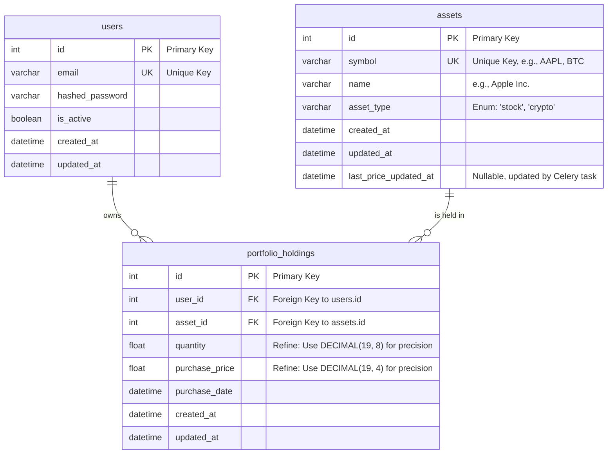

```mermaid
erDiagram
    users {
        int id PK "Primary Key"
        varchar email UK "Unique Key"
        varchar hashed_password
        boolean is_active
        datetime created_at
        datetime updated_at
    }

    assets {
        int id PK "Primary Key"
        varchar symbol UK "Unique Key, e.g., AAPL, BTC"
        varchar name "e.g., Apple Inc."
        varchar asset_type "Enum: 'stock', 'crypto'"
        datetime created_at
        datetime updated_at
        datetime last_price_updated_at "Nullable, updated by Celery task"
    }

    portfolio_holdings {
        int id PK "Primary Key"
        int user_id FK "Foreign Key to users.id"
        int asset_id FK "Foreign Key to assets.id"
        float quantity "Refine: Use DECIMAL(19, 8) for precision"
        float purchase_price "Refine: Use DECIMAL(19, 4) for precision"
        datetime purchase_date
        datetime created_at
        datetime updated_at
    }

    users ||--o{ portfolio_holdings : owns
    assets ||--o{ portfolio_holdings : "is held in"
```
