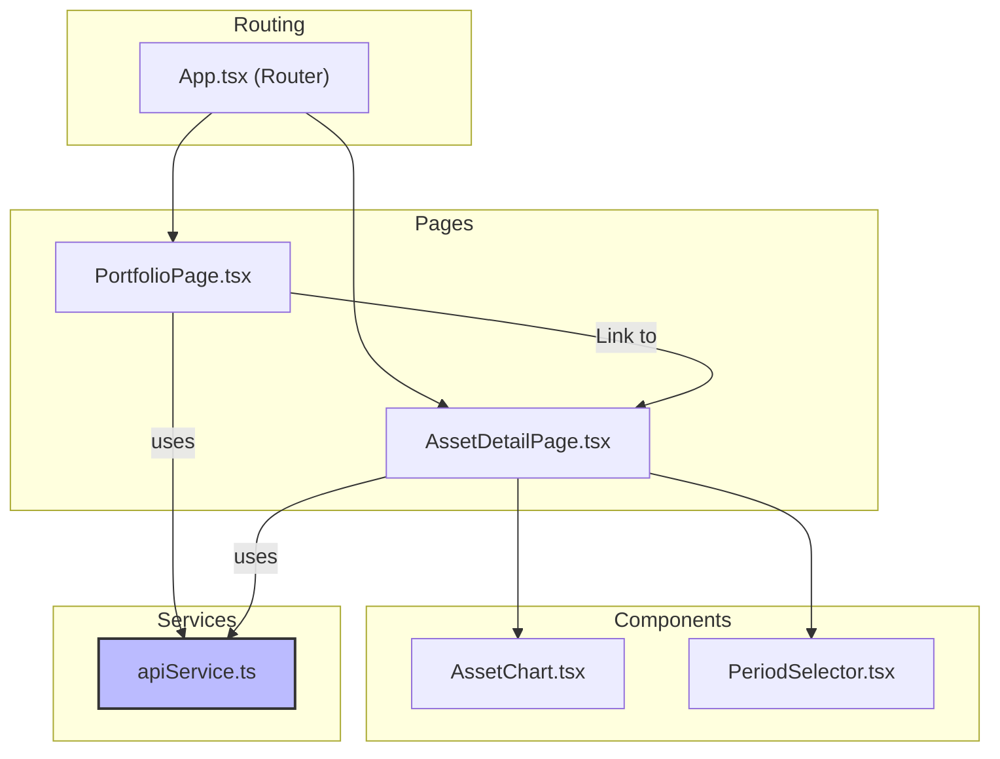

```mermaid
graph TD
    subgraph "Routing"
        App_tsx["App.tsx (Router)"]
    end

    subgraph "Pages"
        PortfolioPage["PortfolioPage.tsx"]
        AssetDetailPage["AssetDetailPage.tsx"]
    end
    
    subgraph "Components"
        AssetChart["AssetChart.tsx"]
        PeriodSelector["PeriodSelector.tsx"]
    end

    subgraph "Services"
        apiService["apiService.ts"]
    end

    App_tsx --> PortfolioPage
    App_tsx --> AssetDetailPage
    
    PortfolioPage -- "Link to" --> AssetDetailPage
    AssetDetailPage --> AssetChart
    AssetDetailPage --> PeriodSelector
    
    PortfolioPage -- "uses" --> apiService
    AssetDetailPage -- "uses" --> apiService
    
    style apiService fill:#bbf,stroke:#333,stroke-width:2px
```
