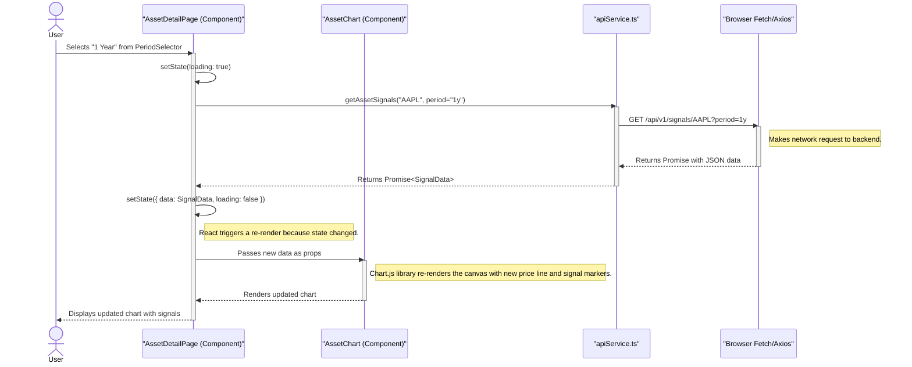

```mermaid
sequenceDiagram
    actor User
    participant Page as "AssetDetailPage (Component)"
    participant Chart as "AssetChart (Component)"
    participant APISvc as "apiService.ts"
    participant BrowserAPI as "Browser Fetch/Axios"
    
    User->>Page: Selects "1 Year" from PeriodSelector
    
    activate Page
    Page->>Page: setState(loading: true)
    Page->>APISvc: getAssetSignals("AAPL", period="1y")
    
    activate APISvc
    APISvc->>BrowserAPI: GET /api/v1/signals/AAPL?period=1y
    
    activate BrowserAPI
    Note right of BrowserAPI: Makes network request to backend.
    BrowserAPI-->>APISvc: Returns Promise with JSON data
    deactivate BrowserAPI
    
    APISvc-->>Page: Returns Promise<SignalData>
    deactivate APISvc
    
    Page->>Page: setState({ data: SignalData, loading: false })
    Note right of Page: React triggers a re-render because state changed.
    
    Page->>Chart: Passes new data as props
    
    activate Chart
    Note right of Chart: Chart.js library re-renders the canvas with new price line and signal markers.
    Chart-->>Page: Renders updated chart
    deactivate Chart
    
    Page-->>User: Displays updated chart with signals
    deactivate Page
```
