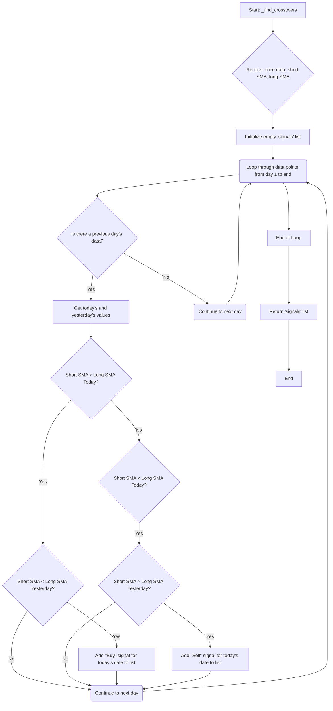

```mermaid
flowchart TD
    A[Start: _find_crossovers] --> B{Receive price data, short SMA, long SMA};
    B --> C[Initialize empty 'signals' list];
    C --> D(Loop through data points from day 1 to end);
    D --> E{Is there a previous day's data?};
    E -->|Yes| F[Get today's and yesterday's values];
    E -->|No| G(Continue to next day);
    G --> D;
    
    F --> H{Short SMA > Long SMA Today?};
    H -->|Yes| I{Short SMA < Long SMA Yesterday?};
    I -->|Yes| J[Add &quot;Buy&quot; signal for today&apos;s date to list];
    I -->|No| K(Continue to next day);
    
    H -->|No| L{Short SMA < Long SMA Today?};
    L -->|Yes| M{Short SMA > Long SMA Yesterday?};
    M -->|Yes| N[Add &quot;Sell&quot; signal for today&apos;s date to list];
    M -->|No| K;
    
    J --> K;
    N --> K;
    K --> D;
    
    D --> O[End of Loop];
    O --> P[Return 'signals' list];
    P --> Q[End];
```
